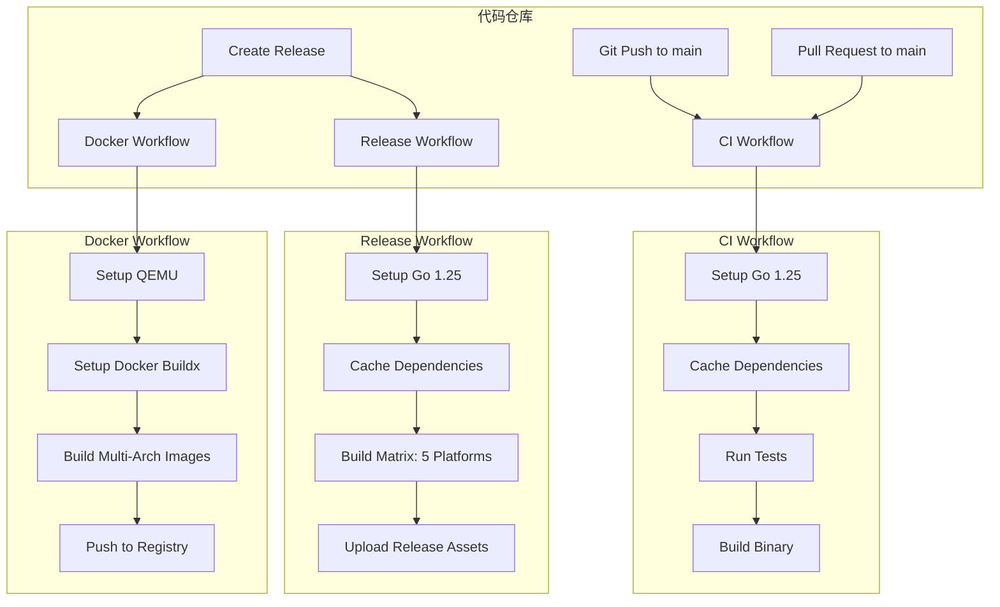

# Design Document: GitHub Actions CI/CD

## Overview

本设计文档描述了为 zbak 项目实现 GitHub Actions CI/CD 自动化流程的技术方案。该系统包含三个核心工作流：

1. **CI 工作流**：在代码提交时自动运行测试和编译验证
2. **Release 工作流**：在发布时构建 5 个平台的二进制包
3. **Docker 工作流**：构建和发布支持 4 个架构的 Docker 镜像

系统设计遵循 GitHub Actions 最佳实践，使用官方 actions，实现依赖缓存优化，并通过 GitHub Secrets 管理敏感信息。

## Architecture

### 工作流架构

系统采用三个独立的 GitHub Actions 工作流文件，每个工作流负责特定的自动化任务：



### 触发机制

- **CI Workflow**: 
  - 触发条件：push 到 main 分支，或针对 main 分支的 pull request
  - 执行环境：ubuntu-latest
  
- **Release Workflow**:
  - 触发条件：创建 GitHub Release（published 事件）
  - 执行环境：ubuntu-latest
  - 构建策略：使用 matrix strategy 并行构建 5 个平台
  
- **Docker Workflow**:
  - 触发条件：创建 GitHub Release（published 事件）
  - 执行环境：ubuntu-latest
  - 构建策略：使用 Docker Buildx 的 multi-platform 功能

### 缓存策略

所有工作流使用 `actions/cache` 或 `actions/setup-go` 内置缓存功能：

- **Go 模块缓存**：使用 `go.sum` 作为缓存键，缓存 `~/go/pkg/mod` 目录
- **Docker 层缓存**：使用 Docker Buildx 的缓存功能，缓存中间层以加速构建

## Components and Interfaces

### 1. CI Workflow (ci.yml)

**职责**：验证代码质量，确保测试通过和编译成功

**关键步骤**：
1. Checkout 代码
2. 设置 Go 环境（1.25.0+）
3. 缓存 Go 模块
4. 下载依赖
5. 运行测试（`go test ./...`）
6. 编译二进制（`go build ./cmd/zbak`）

**输入**：
- 触发事件：push 或 pull_request
- 目标分支：main

**输出**：
- 工作流状态（成功/失败）
- 测试结果
- 编译结果

### 2. Release Workflow (release.yml)

**职责**：构建多平台二进制包并上传到 Release Assets

**关键步骤**：
1. Checkout 代码
2. 设置 Go 环境（1.25.0+）
3. 提取版本号（从 Git tag）
4. 使用 matrix strategy 并行构建 5 个平台：
   - Windows amd64
   - Linux amd64
   - Linux arm
   - macOS amd64
   - macOS arm64
5. 为每个平台设置 GOOS 和 GOARCH
6. 使用 `-ldflags` 注入版本信息
7. 上传二进制文件到 Release Assets

**构建矩阵配置**：
```yaml
matrix:
  include:
    - goos: windows
      goarch: amd64
      output: zbak-windows-amd64.exe
    - goos: linux
      goarch: amd64
      output: zbak-linux-amd64
    - goos: linux
      goarch: arm
      output: zbak-linux-arm
    - goos: darwin
      goarch: amd64
      output: zbak-darwin-amd64
    - goos: darwin
      goarch: arm64
      output: zbak-darwin-arm64
```

**输入**：
- 触发事件：release published
- Git tag（版本号）

**输出**：
- 5 个平台的二进制文件作为 Release Assets

### 3. Docker Workflow (docker.yml)

**职责**：构建多架构 Docker 镜像并推送到镜像仓库

**关键步骤**：
1. Checkout 代码
2. 提取版本号和镜像标签
3. 设置 QEMU（用于跨平台构建）
4. 设置 Docker Buildx
5. 登录镜像仓库（使用 GitHub Secrets）
6. 构建并推送多架构镜像（4 个架构）
7. 同时推送版本标签和 latest 标签

**支持的架构**：
- linux/386
- linux/amd64
- linux/arm64/v8
- linux/arm/v7

**输入**：
- 触发事件：release published
- Git tag（版本号）
- Docker Hub 或 GHCR 认证信息（从 Secrets）

**输出**：
- 多架构 Docker 镜像推送到镜像仓库
- 镜像标签：版本号 + latest

### 4. Dockerfile

**职责**：定义 Docker 镜像的构建过程

**基础镜像**：Alpine Linux（轻量级）

**关键内容**：
1. 使用多阶段构建优化镜像大小
2. 第一阶段：构建 Go 二进制
3. 第二阶段：创建运行时镜像
   - 安装 7-zip（`apk add p7zip`）
   - 复制编译好的 zbak 二进制到 `/usr/local/bin/zbak`
   - 设置工作目录
   - 设置默认 CMD 为 zbak

**接口**：
- 入口点：zbak 命令
- 卷挂载：用户需要挂载宿主机目录以访问文件
- 环境变量：可选的配置覆盖

## Data Models

### 工作流配置数据结构

虽然 GitHub Actions 使用 YAML 配置而非代码数据结构，但我们可以定义关键的配置模式：

#### CI Workflow 配置模式

```yaml
name: CI
on:
  push:
    branches: [main]
  pull_request:
    branches: [main]
jobs:
  test:
    runs-on: ubuntu-latest
    steps:
      - uses: actions/checkout@v4
      - uses: actions/setup-go@v5
        with:
          go-version: '>=1.25.0'
          cache: true
      - run: go test ./...
      - run: go build ./cmd/zbak
```

#### Release Workflow 配置模式

```yaml
name: Release
on:
  release:
    types: [published]
jobs:
  build:
    runs-on: ubuntu-latest
    strategy:
      matrix:
        include:
          - {goos: windows, goarch: amd64, output: zbak-windows-amd64.exe}
          - {goos: linux, goarch: amd64, output: zbak-linux-amd64}
          - {goos: linux, goarch: arm, output: zbak-linux-arm}
          - {goos: darwin, goarch: amd64, output: zbak-darwin-amd64}
          - {goos: darwin, goarch: arm64, output: zbak-darwin-arm64}
    steps:
      - uses: actions/checkout@v4
      - uses: actions/setup-go@v5
        with:
          go-version: '>=1.25.0'
          cache: true
      - name: Build
        env:
          GOOS: ${{ matrix.goos }}
          GOARCH: ${{ matrix.goarch }}
        run: |
          VERSION=${GITHUB_REF#refs/tags/}
          go build -ldflags "-X main.version=$VERSION" -o ${{ matrix.output }} ./cmd/zbak
      - uses: actions/upload-release-asset@v1
        with:
          upload_url: ${{ github.event.release.upload_url }}
          asset_path: ./${{ matrix.output }}
          asset_name: ${{ matrix.output }}
```

#### Docker Workflow 配置模式

```yaml
name: Docker
on:
  release:
    types: [published]
jobs:
  docker:
    runs-on: ubuntu-latest
    steps:
      - uses: actions/checkout@v4
      - uses: docker/setup-qemu-action@v3
      - uses: docker/setup-buildx-action@v3
      - uses: docker/login-action@v3
        with:
          username: ${{ secrets.DOCKER_USERNAME }}
          password: ${{ secrets.DOCKER_PASSWORD }}
      - uses: docker/build-push-action@v5
        with:
          context: .
          platforms: linux/386,linux/amd64,linux/arm64/v8,linux/arm/v7
          push: true
          tags: |
            username/zbak:${{ github.ref_name }}
            username/zbak:latest
```

#### Dockerfile 结构

```dockerfile
# 构建阶段
FROM golang:1.25-alpine AS builder
WORKDIR /build
COPY go.mod go.sum ./
RUN go mod download
COPY . .
RUN CGO_ENABLED=0 go build -ldflags "-s -w" -o zbak ./cmd/zbak

# 运行阶段
FROM alpine:latest
RUN apk add --no-cache p7zip
COPY --from=builder /build/zbak /usr/local/bin/zbak
WORKDIR /data
CMD ["zbak"]
```

### 版本信息数据模型

版本信息通过 `-ldflags` 在编译时注入到二进制文件中：

```go
// 在 cmd/zbak/main.go 中
var version = "dev" // 默认值，会被 ldflags 覆盖

// 编译命令
// go build -ldflags "-X main.version=v1.0.0" ./cmd/zbak
```

### Release Asset 命名规范

```
zbak-{os}-{arch}[.exe]

示例：
- zbak-windows-amd64.exe
- zbak-linux-amd64
- zbak-linux-arm
- zbak-darwin-amd64
- zbak-darwin-arm64
```

### Docker 镜像标签规范

```
{registry}/{username}/zbak:{tag}

示例：
- docker.io/username/zbak:v1.0.0
- docker.io/username/zbak:latest
- ghcr.io/username/zbak:v1.0.0
- ghcr.io/username/zbak:latest
```


## Correctness Properties

*A property is a characteristic or behavior that should hold true across all valid executions of a system-essentially, a formal statement about what the system should do. Properties serve as the bridge between human-readable specifications and machine-verifiable correctness guarantees.*

由于本功能主要是配置 GitHub Actions 工作流，大部分验收标准是关于配置文件内容的验证（属于示例测试），只有少数几个是可以表达为通用属性的。

### Property 1: Release Asset 命名规范

*For any* 构建平台配置（GOOS 和 GOARCH 组合），生成的 Release Asset 文件名应该包含平台标识符和架构标识符，格式为 `zbak-{goos}-{goarch}[.exe]`

**Validates: Requirements 7.1**

### Property 2: 版本号语义化格式

*For any* 从 Git tag 提取的版本号，该版本号应该遵循语义化版本规范，匹配模式 `v{major}.{minor}.{patch}` 或 `v{major}.{minor}.{patch}-{prerelease}`

**Validates: Requirements 7.4**

### 配置验证示例测试

以下验收标准通过示例测试来验证，而非属性测试。这些测试验证配置文件是否包含正确的内容：

#### CI Workflow 配置验证
- 验证 `.github/workflows/ci.yml` 文件存在
- 验证触发条件包含 `push` 到 `main` 分支
- 验证触发条件包含 `pull_request` 到 `main` 分支
- 验证使用 Go 1.25.0 或更高版本
- 验证包含 `go test ./...` 步骤
- 验证包含 `go build ./cmd/zbak` 步骤
- 验证运行环境为 `ubuntu-latest`
- 验证启用了 Go 模块缓存

**Validates: Requirements 1.1, 1.2, 1.3, 1.4, 1.5, 1.8, 6.1**

#### Release Workflow 配置验证
- 验证 `.github/workflows/release.yml` 文件存在
- 验证触发条件为 `release.published`
- 验证使用 Go 1.25.0 或更高版本
- 验证构建矩阵包含 5 个平台配置：
  - `{goos: windows, goarch: amd64, output: zbak-windows-amd64.exe}`
  - `{goos: linux, goarch: amd64, output: zbak-linux-amd64}`
  - `{goos: linux, goarch: arm, output: zbak-linux-arm}`
  - `{goos: darwin, goarch: amd64, output: zbak-darwin-amd64}`
  - `{goos: darwin, goarch: arm64, output: zbak-darwin-arm64}`
- 验证包含上传 Release Asset 的步骤
- 验证从 Git tag 提取版本号
- 验证编译命令包含 `-ldflags` 注入版本信息
- 验证启用了 Go 模块缓存

**Validates: Requirements 2.1, 2.2, 2.3, 2.4, 2.5, 2.6, 2.7, 2.8, 2.9, 2.10, 2.11, 2.12, 2.13, 6.2, 7.3, 7.6**

#### Docker Workflow 配置验证
- 验证 `.github/workflows/docker.yml` 文件存在
- 验证触发条件为 `release.published`
- 验证包含 QEMU 设置步骤
- 验证包含 Docker Buildx 设置步骤
- 验证包含登录镜像仓库步骤，使用 GitHub Secrets
- 验证构建平台列表包含：
  - `linux/386`
  - `linux/amd64`
  - `linux/arm64/v8`
  - `linux/arm/v7`
- 验证镜像标签包含版本号和 `latest`
- 验证启用了 Docker 层缓存

**Validates: Requirements 3.1, 3.3, 3.4, 3.5, 3.6, 3.10, 3.11, 3.12, 5.5, 6.3**

#### Dockerfile 配置验证
- 验证 `Dockerfile` 文件存在
- 验证基础镜像使用 Alpine Linux
- 验证包含安装 `p7zip` 的指令
- 验证包含复制 zbak 二进制到 `/usr/local/bin/zbak` 的指令
- 验证 CMD 指令设置为 `zbak`

**Validates: Requirements 3.2, 3.7, 3.8, 3.9**

#### 工作流文件组织验证
- 验证所有工作流文件位于 `.github/workflows/` 目录
- 验证 CI 工作流文件命名为 `ci.yml`
- 验证 Release 工作流文件命名为 `release.yml`
- 验证 Docker 工作流文件命名为 `docker.yml`
- 验证工作流使用官方或广泛信任的 GitHub Actions
- 验证工作流声明了必要的权限

**Validates: Requirements 5.1, 5.2, 5.3, 5.4, 5.7, 5.8**

#### Docker 镜像集成测试
- 验证构建的 Docker 镜像可以运行
- 验证在容器中执行 `zbak --help` 显示帮助信息
- 验证在容器中执行 `7z` 显示版本信息
- 验证 zbak 可以在容器中调用 7z 执行压缩操作

**Validates: Requirements 4.1, 4.2, 4.3, 4.4, 4.6**

## Error Handling

### 工作流执行失败

GitHub Actions 平台提供了内置的错误处理机制：

1. **步骤失败**：当任何步骤返回非零退出码时，工作流自动标记为失败
2. **失败通知**：GitHub 会通过邮件和 UI 通知工作流失败
3. **失败日志**：所有步骤的输出都会被记录，便于调试

我们的工作流设计遵循"快速失败"原则：
- 测试失败时立即停止 CI 工作流
- 编译失败时立即停止构建
- Docker 构建失败时立即停止推送

### 构建矩阵失败策略

Release Workflow 使用构建矩阵并行构建 5 个平台。默认情况下：
- 如果任何一个平台构建失败，整个工作流标记为失败
- 但其他平台的构建会继续完成
- 可以通过 `fail-fast: false` 配置确保所有平台都尝试构建

### 认证失败处理

Docker Workflow 需要登录镜像仓库：
- 如果 Secrets 未配置或无效，登录步骤会失败
- 工作流会立即停止，不会尝试推送镜像
- 错误信息会清楚地指出认证问题

### 版本号提取失败

如果 Git tag 格式不正确：
- 版本号提取可能失败或得到意外值
- 建议在工作流中添加版本号格式验证步骤
- 如果版本号无效，应该提前失败而不是继续构建

### 依赖下载失败

如果 Go 模块下载失败（网络问题或依赖不可用）：
- `go mod download` 步骤会失败
- 工作流会立即停止
- 缓存机制可以减少对外部网络的依赖

### Docker 多架构构建失败

如果某个架构的构建失败：
- Docker Buildx 会报告具体的架构和错误
- 整个构建会失败，不会推送部分架构的镜像
- 这确保了镜像的完整性

## Testing Strategy

### 测试方法概述

本功能的测试采用双重策略：

1. **配置验证测试**（单元测试）：验证工作流配置文件的内容和结构
2. **属性测试**（属性测试）：验证命名规范和版本格式等通用规则
3. **集成测试**：验证工作流在 GitHub Actions 环境中的实际执行

### 配置验证测试

使用单元测试验证 YAML 配置文件的内容：

**测试工具**：
- Go 的 `gopkg.in/yaml.v3` 库解析 YAML 文件
- 标准库 `testing` 包编写测试

**测试内容**：
- 解析 `.github/workflows/*.yml` 文件
- 验证触发条件、运行环境、步骤配置等
- 验证构建矩阵包含所有必需的平台
- 验证使用了官方 GitHub Actions
- 验证 Secrets 的使用而非硬编码凭据

**示例测试**：
```go
func TestCIWorkflowConfiguration(t *testing.T) {
    // 读取并解析 ci.yml
    data, err := os.ReadFile(".github/workflows/ci.yml")
    require.NoError(t, err)
    
    var workflow WorkflowConfig
    err = yaml.Unmarshal(data, &workflow)
    require.NoError(t, err)
    
    // 验证触发条件
    assert.Contains(t, workflow.On.Push.Branches, "main")
    assert.Contains(t, workflow.On.PullRequest.Branches, "main")
    
    // 验证 Go 版本
    assert.GreaterOrEqual(t, workflow.Jobs["test"].Steps[1].With["go-version"], "1.25.0")
    
    // 验证包含测试和编译步骤
    assert.Contains(t, getStepCommands(workflow), "go test ./...")
    assert.Contains(t, getStepCommands(workflow), "go build ./cmd/zbak")
}
```

### 属性测试

使用属性测试验证通用规则：

**测试库**：
- 使用 `github.com/leanovate/gopter` 或类似的 Go 属性测试库
- 每个属性测试运行至少 100 次迭代

**Property 1: Release Asset 命名规范**
```go
// Feature: github-actions-cicd, Property 1: Release Asset 命名规范
func TestProperty_ReleaseAssetNaming(t *testing.T) {
    properties := gopter.NewProperties(nil)
    
    properties.Property("Release assets follow naming convention", 
        prop.ForAll(
            func(goos, goarch string) bool {
                filename := generateAssetName(goos, goarch)
                
                // 验证文件名包含平台和架构
                if !strings.Contains(filename, goos) {
                    return false
                }
                if !strings.Contains(filename, goarch) {
                    return false
                }
                
                // 验证格式
                expectedPattern := fmt.Sprintf("zbak-%s-%s", goos, goarch)
                if goos == "windows" {
                    expectedPattern += ".exe"
                }
                
                return filename == expectedPattern
            },
            gen.OneConstOf("windows", "linux", "darwin"),
            gen.OneConstOf("amd64", "arm", "arm64", "386"),
        ))
    
    properties.TestingRun(t, gopter.ConsoleReporter(false))
}
```

**Property 2: 版本号语义化格式**
```go
// Feature: github-actions-cicd, Property 2: 版本号语义化格式
func TestProperty_SemanticVersionFormat(t *testing.T) {
    properties := gopter.NewProperties(nil)
    
    properties.Property("Version numbers follow semantic versioning", 
        prop.ForAll(
            func(major, minor, patch uint) bool {
                version := fmt.Sprintf("v%d.%d.%d", major, minor, patch)
                
                // 验证版本号匹配语义化版本规范
                semverPattern := regexp.MustCompile(`^v\d+\.\d+\.\d+(-[a-zA-Z0-9.-]+)?$`)
                return semverPattern.MatchString(version)
            },
            gen.UIntRange(0, 100),
            gen.UIntRange(0, 100),
            gen.UIntRange(0, 1000),
        ))
    
    properties.TestingRun(t, gopter.ConsoleReporter(false))
}
```

### 集成测试

**本地集成测试**：
- 使用 `act` 工具在本地运行 GitHub Actions 工作流
- 验证工作流可以成功执行
- 验证生成的产物符合预期

**Docker 镜像集成测试**：
```bash
# 构建镜像
docker build -t zbak:test .

# 测试 zbak 命令
docker run --rm zbak:test zbak --help

# 测试 7z 命令
docker run --rm zbak:test 7z

# 测试实际备份功能（需要挂载卷）
docker run --rm -v $(pwd)/testdata:/data zbak:test zbak backup --config /data/config.yaml
```

**GitHub Actions 环境测试**：
- 在测试分支上触发工作流
- 验证 CI 工作流在 PR 时正确执行
- 创建测试 Release 验证 Release 和 Docker 工作流
- 检查生成的 Release Assets 和 Docker 镜像

### 测试覆盖率目标

- **配置验证测试**：100% 覆盖所有配置要求
- **属性测试**：每个属性至少 100 次迭代
- **集成测试**：覆盖所有工作流的端到端执行

### 持续测试

- 配置验证测试在 CI 工作流中自动运行
- 每次修改工作流配置时都会触发测试
- 确保配置变更不会破坏现有功能

