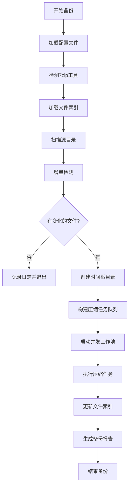
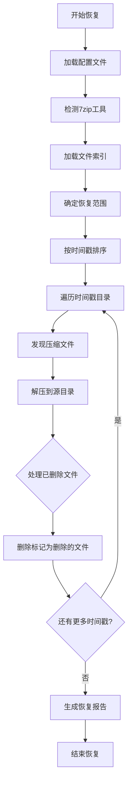

# 设计文档 - NAS备份工具

## 概述

NAS备份工具是一个使用Go语言开发的命令行应用程序，旨在提供高效、安全的增量备份解决方案。该工具通过调用系统7zip命令行工具实现加密分卷压缩，支持并发处理以提高备份效率，并提供完整的恢复功能。

### 核心特性

- **增量备份**：通过文件索引跟踪文件变化，仅备份修改、新增或删除的文件
- **加密分卷压缩**：使用7zip进行AES-256加密和分卷压缩，确保数据安全
- **智能压缩策略**：根据目录大小和结构自动选择最优压缩方案
- **并发处理**：支持多个目录并发压缩，充分利用系统资源
- **版本管理**：每次备份创建独立的时间戳目录，支持多版本保留
- **灵活恢复**：支持完整恢复或选择性恢复特定时间点的备份
- **跨平台支持**：兼容Linux、Windows和macOS操作系统

### 设计目标

1. **可靠性**：确保备份数据的完整性和一致性
2. **效率**：通过增量备份和并发处理提高备份速度
3. **安全性**：使用强加密保护备份数据
4. **可维护性**：清晰的代码结构和完整的测试覆盖
5. **易用性**：简洁的命令行接口和详细的日志输出

## 架构

### 系统架构

系统采用分层架构设计，从上到下分为以下层次：

```
┌─────────────────────────────────────────┐
│         命令行接口层 (CLI Layer)          │
│  - 参数解析                              │
│  - 子命令路由                            │
│  - 帮助信息                              │
└─────────────────────────────────────────┘
                    ↓
┌─────────────────────────────────────────┐
│        业务逻辑层 (Business Layer)        │
│  - 备份协调器 (BackupCoordinator)        │
│  - 恢复协调器 (RestoreCoordinator)       │
│  - 增量检测器 (IncrementalDetector)      │
└─────────────────────────────────────────┘
                    ↓
┌─────────────────────────────────────────┐
│        服务层 (Service Layer)            │
│  - 压缩服务 (CompressionService)         │
│  - 索引服务 (IndexService)               │
│  - 文件系统服务 (FileSystemService)      │
└─────────────────────────────────────────┘
                    ↓
┌─────────────────────────────────────────┐
│        基础设施层 (Infrastructure)        │
│  - 配置管理 (ConfigManager)              │
│  - 7zip包装器 (7zipWrapper)              │
│  - 日志记录器 (Logger)                   │
│  - 并发池 (WorkerPool)                   │
└─────────────────────────────────────────┘
```

### 核心工作流程

#### 备份流程



#### 恢复流程



### 并发模型

系统使用工作池模式实现并发压缩：

```
                    ┌──────────────┐
                    │  Task Queue  │
                    └──────────────┘
                           │
        ┌──────────────────┼──────────────────┐
        ↓                  ↓                  ↓
   ┌─────────┐        ┌─────────┐       ┌─────────┐
   │ Worker 1│        │ Worker 2│  ...  │ Worker N│
   └─────────┘        └─────────┘       └─────────┘
        │                  │                  │
        └──────────────────┼──────────────────┘
                           ↓
                    ┌──────────────┐
                    │ Index Update │
                    │  (Mutex Lock)│
                    └──────────────┘
```

- 主协程创建任务队列并分发压缩任务
- N个工作协程并发执行压缩操作
- 使用互斥锁保护文件索引的并发更新
- 使用WaitGroup确保所有任务完成

## 组件和接口

### 1. 命令行接口 (CLI)

**职责**：解析命令行参数，路由到相应的业务逻辑

**接口**：
```go
type CLI interface {
    Run(args []string) error
}
```

**实现**：
- 使用cobra或flag库解析命令行参数
- 支持子命令：backup、restore
- 支持参数：--config、--timestamp、--from、--to、--help、--version

### 2. 配置管理器 (ConfigManager)

**职责**：加载和验证YAML配置文件

**接口**：
```go
type ConfigManager interface {
    Load(path string) (*Config, error)
    Validate(config *Config) error
}

type Config struct {
    SourceDir    string `yaml:"source_dir"`
    TargetDir    string `yaml:"target_dir"`
    VolumeSize   int64  `yaml:"volume_size"`
    Password     string `yaml:"password"`
    Concurrency  int    `yaml:"concurrency"`
}
```

**错误处理**：
- 配置文件不存在：返回ErrConfigNotFound
- 配置格式无效：返回ErrInvalidConfigFormat
- 必需字段缺失：返回ErrMissingRequiredField

### 3. 文件索引服务 (IndexService)

**职责**：管理文件索引的读写和更新

**接口**：
```go
type IndexService interface {
    Load(path string) (*FileIndex, error)
    Save(path string, index *FileIndex) error
    AddEntry(index *FileIndex, entry FileEntry) error
    MarkDeleted(index *FileIndex, path string) error
    GetEntry(index *FileIndex, path string) (*FileEntry, bool)
}

type FileIndex struct {
    Files map[string]FileEntry `yaml:"files"`
}

type FileEntry struct {
    SourcePath      string    `yaml:"source_path"`
    Size            int64     `yaml:"size"`
    ModTime         time.Time `yaml:"mod_time"`
    ArchivePath     string    `yaml:"archive_path"`
    TimestampDir    string    `yaml:"timestamp_dir"`
    Deleted         bool      `yaml:"deleted"`
}
```

**线程安全**：
- 使用sync.Mutex保护并发访问
- 提供线程安全的AddEntry和MarkDeleted方法

### 4. 增量检测器 (IncrementalDetector)

**职责**：比较源目录和文件索引，识别需要备份的文件

**接口**：
```go
type IncrementalDetector interface {
    Detect(sourceDir string, index *FileIndex) (*ChangeSet, error)
}

type ChangeSet struct {
    NewFiles      []string
    ModifiedFiles []string
    DeletedFiles  []string
    UnchangedFiles []string
}
```

**检测逻辑**：
- 遍历源目录所有文件
- 对比文件大小和修改时间
- 标记新增、修改、删除和未变化的文件

### 5. 文件系统服务 (FileSystemService)

**职责**：提供文件系统操作的抽象

**接口**：
```go
type FileSystemService interface {
    CalculateDirSize(path string) (int64, error)
    HasSubdirs(path string) (bool, error)
    ListFiles(path string) ([]string, error)
    CreateDir(path string) error
    FileExists(path string) bool
}
```

**实现细节**：
- 使用filepath.Walk遍历目录
- 排除符号链接
- 处理跨平台路径分隔符

### 6. 压缩服务 (CompressionService)

**职责**：决定压缩策略并执行压缩操作

**接口**：
```go
type CompressionService interface {
    CompressDirectory(ctx context.Context, task CompressionTask) error
    DetermineStrategy(dirPath string, volumeSize int64) (CompressionStrategy, error)
}

type CompressionTask struct {
    SourcePath   string
    TargetPath   string
    Password     string
    VolumeSize   int64
    Strategy     CompressionStrategy
}

type CompressionStrategy int

const (
    StrategySmallDir CompressionStrategy = iota  // 小目录单文件压缩
    StrategyLargeNoSubdir                        // 大目录无子目录分卷压缩
    StrategyLargeWithSubdir                      // 大目录有子目录递归压缩
)
```

**策略选择逻辑**：
1. 计算目录总大小
2. 如果大小 < 分卷大小：使用StrategySmallDir
3. 如果大小 >= 分卷大小：
   - 检查是否有子目录
   - 无子目录：使用StrategyLargeNoSubdir
   - 有子目录：使用StrategyLargeWithSubdir

### 7. 7zip包装器 (7zipWrapper)

**职责**：封装7zip命令行工具的调用

**接口**：
```go
type SevenZipWrapper interface {
    Detect() (string, error)
    Compress(params CompressParams) error
    Extract(params ExtractParams) error
}

type CompressParams struct {
    Sources     []string
    Output      string
    Password    string
    VolumeSize  int64
}

type ExtractParams struct {
    Archive     string
    OutputDir   string
    Password    string
}
```

**实现细节**：
- 检测7z或7za命令
- 构建7zip命令行参数
- 捕获标准输出和标准错误
- 处理命令执行失败

### 8. 工作池 (WorkerPool)

**职责**：管理并发压缩任务的执行

**接口**：
```go
type WorkerPool interface {
    Start(workerCount int)
    Submit(task CompressionTask)
    Wait() []error
    Stop()
}
```

**实现**：
- 使用channel作为任务队列
- 使用goroutine作为工作协程
- 使用sync.WaitGroup等待所有任务完成
- 收集并返回所有错误

### 9. 备份协调器 (BackupCoordinator)

**职责**：协调整个备份流程

**接口**：
```go
type BackupCoordinator interface {
    Execute(config *Config) error
}
```

**流程**：
1. 加载文件索引
2. 执行增量检测
3. 创建时间戳目录
4. 构建压缩任务
5. 启动工作池执行任务
6. 更新文件索引
7. 生成备份报告

### 10. 恢复协调器 (RestoreCoordinator)

**职责**：协调整个恢复流程

**接口**：
```go
type RestoreCoordinator interface {
    Execute(config *Config, options RestoreOptions) error
}

type RestoreOptions struct {
    Timestamp    string
    FromTime     string
    ToTime       string
}
```

**流程**：
1. 加载文件索引
2. 确定恢复范围（单个时间戳或范围）
3. 按时间戳排序
4. 依次解压每个时间戳的备份
5. 处理已删除文件
6. 生成恢复报告

### 11. 日志记录器 (Logger)

**职责**：提供统一的日志记录接口

**接口**：
```go
type Logger interface {
    Info(msg string, args ...interface{})
    Warn(msg string, args ...interface{})
    Error(msg string, args ...interface{})
    SetOutput(w io.Writer)
}
```

**实现**：
- 同时输出到标准输出和日志文件
- 日志文件命名：backup-YYYY-MM-DD-HH-MM-SS.log
- 使用缓冲写入提高性能

## 数据模型

### 配置文件格式 (config.yaml)

```yaml
source_dir: /path/to/nas/source
target_dir: /path/to/backup/target
volume_size: 4294967296  # 4GB in bytes
password: your_secure_password
concurrency: 4
```

**字段说明**：
- `source_dir`：源目录路径（必需）
- `target_dir`：目标目录路径（必需）
- `volume_size`：分卷大小，单位字节（必需）
- `password`：加密密码（必需）
- `concurrency`：并发数，最小值为1（必需）

### 文件索引格式 (index.yaml)

```yaml
files:
  "relative/path/to/file1.txt":
    source_path: "relative/path/to/file1.txt"
    size: 1024
    mod_time: 2024-01-15T10:30:00Z
    archive_path: "2024-01-15-10-30-00/relative/path/to/dir.7z.001"
    timestamp_dir: "2024-01-15-10-30-00"
    deleted: false
  "relative/path/to/file2.txt":
    source_path: "relative/path/to/file2.txt"
    size: 2048
    mod_time: 2024-01-15T10:30:00Z
    archive_path: "2024-01-15-10-30-00/relative/path/to/dir.7z.001"
    timestamp_dir: "2024-01-15-10-30-00"
    deleted: true
```

**字段说明**：
- `source_path`：文件在源目录中的相对路径
- `size`：文件大小（字节）
- `mod_time`：文件修改时间（ISO 8601格式）
- `archive_path`：文件所在的压缩包路径（相对于目标目录）
- `timestamp_dir`：文件所属的时间戳目录
- `deleted`：文件是否已被删除

### 目录结构

```
target_dir/
├── index.yaml                          # 文件索引
├── backup-2024-01-15-10-30-00.log     # 备份日志
├── 2024-01-15-10-30-00/               # 时间戳目录
│   ├── dir1.7z.001                    # 小目录压缩
│   ├── dir2/
│   │   ├── files.7z.001               # 目录中的文件
│   │   ├── files.7z.002
│   │   └── subdir1.7z.001             # 子目录压缩
│   └── dir3/
│       ├── subdir1.7z.001
│       └── subdir2.7z.001
└── 2024-01-16-14-20-00/               # 另一个时间戳目录
    └── ...
```

### 内部数据结构

#### ChangeSet（变化集）

```go
type ChangeSet struct {
    NewFiles       []string  // 新增文件列表
    ModifiedFiles  []string  // 修改文件列表
    DeletedFiles   []string  // 删除文件列表
    UnchangedFiles []string  // 未变化文件列表
}
```

#### CompressionTask（压缩任务）

```go
type CompressionTask struct {
    SourcePath   string              // 源路径
    TargetPath   string              // 目标路径
    Password     string              // 加密密码
    VolumeSize   int64               // 分卷大小
    Strategy     CompressionStrategy // 压缩策略
    Files        []string            // 要压缩的文件列表（可选）
}
```

#### BackupReport（备份报告）

```go
type BackupReport struct {
    StartTime       time.Time
    EndTime         time.Time
    TotalFiles      int
    NewFiles        int
    ModifiedFiles   int
    DeletedFiles    int
    UnchangedFiles  int
    SuccessCount    int
    FailureCount    int
    TotalSize       int64
    Errors          []error
}
```

#### RestoreReport（恢复报告）

```go
type RestoreReport struct {
    StartTime       time.Time
    EndTime         time.Time
    RestoredFiles   int
    DeletedFiles    int
    FailedFiles     int
    TotalSize       int64
    Errors          []error
}
```

